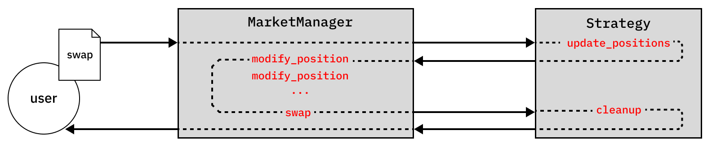
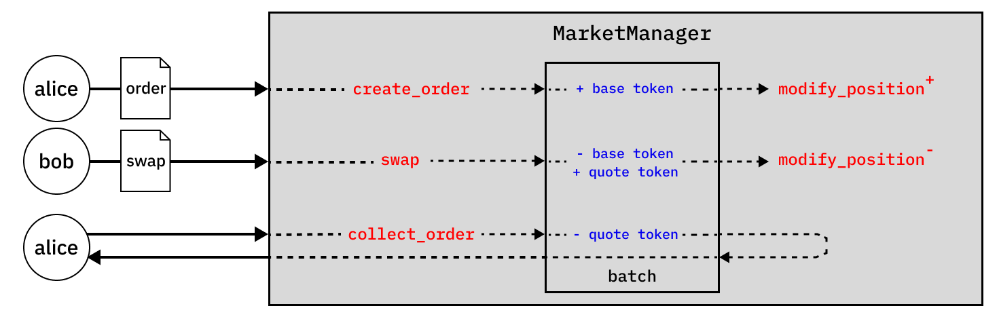
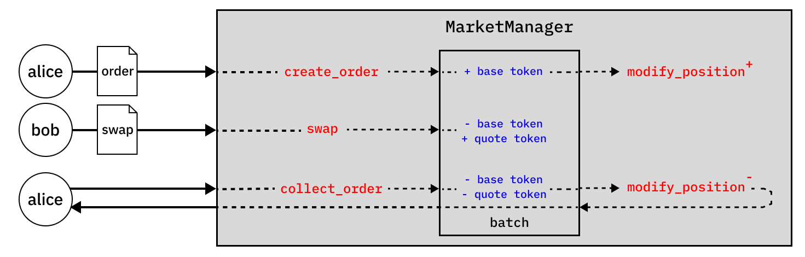

# Technical overview

This document provides a technical overview of Haiko's smart contracts. It focuses on the five main functions called by users, breaking down their internal call logic and mapping interactions with external `Strategy` contracts.

It may be helpful to first review the Naming Conventions section of [Haiko vs Uniswap](./2-haiko-vs-uniswap.md) before reading this document.

## Contracts

### `MarketManager`

The `MarketManager` contract is the main entrypoint for user interactions. It is responsible for:

1. Creating new markets
2. Adding and removing liquidity to / from new or existing positions
3. Swapping assets through one or multiple markets
4. Placing and collecting limit orders
5. Other miscellaneous actions such as flash loans, sweeping etc

### `Strategy`

`Strategy` contracts are contracts that can be optionally deployed alongside a market. They are responsible for:

1. Providing liquidity to the market by placing and removing liquidity positions and limit orders
2. Collecting and distributing swap fees on behalf of LPs that deposit to the strategy

All `Strategy` contracts must implement a minimal `IStrategy` interface:

```rust
#[starknet::interface]
trait IStrategy<TContractState> {
  // View
  fn market_manager(self: @TContractState) -> ContractAddress;
  fn market_id(self: @TContractState) -> felt252;
  fn strategy_name(self: @TContractState) -> felt252;
  fn strategy_symbol(self: @TContractState) -> felt252;
  fn placed_positions(self: @TContractState, market_id: felt252) -> Span<PositionInfo>;
  fn queued_positions(self: @TContractState, market_id: felt252, swap_params: Option<SwapParams>) -> Span<PositionInfo>;
  // External
  fn update_positions(ref self: TContractState, market_id: felt252, params: SwapParams);
}
```

### `Quoter`

The `Quoter` contract is responsible for providing quotes for swaps.

It calls `quote()` and `quote_multiple()` in the `MarketManager` contract, and extracts the quoted amount via an error message.

Alternatively, it can return an array of quotes by calling `unsafe_quote()` and `unsafe_quote_multiple()` in the `MarketManager` contract, which always return correct quotes for non-strategy markets, and return correct quotes for strategy markets so long as `placed_positions` and `queued_positions` are reported correctly.

## Contract interactions

### Creating a market

A market is created by calling `create_market()` in the `MarketManager` contract.

```rust
fn create_market(
  ref self: TContractState,
  base_token: ContractAddress,
  quote_token: ContractAddress,
  width: u32,
  strategy: ContractAddress,
  swap_fee_rate: u16,
  fee_controller: ContractAddress,
  start_limit: u32,
  controller: ContractAddress,
  configs: Option<MarketConfig>,
) -> felt252;
```

This initialises a market with the provided parameters and assigns a `market_id`, which is simply the Poseidon chain hash of the immutable parameters (i.e. those in the list above, excluding `configs`).

Duplicate markets are disallowed.

### Adding or removing liquidity

Liquidity providers can add or remove liquidity by calling `modify_position()`, and passing in the relevant `market_id`, a price range denominated in limits, and either a positive or negative `liquidity_delta`.

```rust
fn modify_position(
  ref self: TContractState,
  market_id: felt252,
  lower_limit: u32,
  upper_limit: u32,
  liquidity_delta: i128,
) -> (i128, i128, u256, u256);
```

### Collecting fees

Similarly, fees can be collected from an existing position by calling `modify_position`, and passing in a `liquidity_delta` of 0.

### Swapping tokens (single market)

A swap is intitiated when a swapper calls `swap()` in the `MarketManager` contract.

```rust
fn swap(
  ref self: TContractState,
  market_id: felt252,
  is_buy: bool,
  amount: u256,
  exact_input: bool,
  threshold_sqrt_price: Option<u256>,
  threshold_amount: Option<u256>,
  deadline: Option<u64>,
) -> (u256, u256, u256);
```

The `swap()` function iteratively searches for the next initialised limit in the market and fills the order against available liquidity up to this limit.

If the market is deployed with a strategy, this complicates the call logic somewhat:

- The swap will first call the `update_positions()` function of the `Strategy` contract. This can include instructions to place or remove liquidity positions or limit orders from the market, which may involve further `modify_position` calls to the `MarketManager` contract.
- Once executed, the call returns to the `MarketManager` context and executes the swap.

The diagram below summarises the execution flow:

#### Fig 1. Swap execution flow



### Swapping tokens (multi market)

A multi-market swap is intitiated when a swapper calls `swap_multiple()` in the `MarketManager` contract.

```rust
fn swap_multiple(
  ref self: TContractState,
  in_token: ContractAddress,
  out_token: ContractAddress,
  amount: u256,
  route: Span<felt252>,
  threshold_amount: Option<u256>,
  deadline: Option<u64>,
) -> u256;
```

`swap_multiple()` loops through each market in the route and calls `swap()`, passing in the output amount of the previous swap as the input amount. The execution flow for each `swap` is identical to the single market case.

### Creating a limit order

Limit orders can be placed by calling `create_order()` in the `MarketManager` contract.

```rust
fn create_order(
    ref self: TContractState,
    market_id: felt252,
    is_bid: bool,
    limit: u32,
    liquidity_delta: u128,
) -> felt252;
```

Doing so initialises an order with the provided parameters and assigns an `order_id` from an incrementing counter. Under the hood, creating a limit order places a liquidity position at the specified `limit`(technically, over the interval between `limit` and `limit` + `width`).

All limit orders placed at the same `limit` are batched for efficient filling. Once filled, a `nonce` counter increases for that limit to start a new batch.

The filling of limit orders is handled in the `swap()` function. While iterating through initialised limits, the `swap()` function will also check for limit orders that it should fill. If, after swapping, a limit order becomes:

- Fully filled, the liquidity for that batch is removed by calling the internal `_modify_position()` function, and the base and quote balances for that batch updated.
- Partially filled, the base and quote balances for the batch are updated without removing liquidity from the batch.

### Collecting a limit order

Collecting a limit order returns any filled and unfilled amounts to the order owner.

In a traditional order book setting, proceeds from filled limit orders are automatically returned to the swapper. Alternatively, the order can be manually cancelled to return any unfilled or partially filled proceeds. In Haiko, both actions are combined into a single `collect_order()` function to achieve the desired outcome while remaining gas efficient.

```rust
fn collect_order(
  ref self: TContractState,
  market_id: felt252,
  order_id: felt252,
) -> (u256, u256);
```

Collecting an order withdraws the owner's pro rata share of a batch's base and quote balances, plus earned fees up to the swap fee rate. If the order is partially filled, a further `_modify_position()` call is made to remove the user's liquidity from the batch and pool.

The lifecycle of a limit order is summarised in the diagrams below.

#### Fig 2a. Order execution flow (fully filled)



#### Fig 2b. Order execution flow (partially filled)



### Quoting a swap

Obtaining quotes for swaps and multi-market swaps is done via the `Quoter` contract, by calling `quote()` and `quote_multiple()` respectively.

As explained above, the quoted amount is extracted via an error message to avoid committing state updates to the `MarketManager` contract.

```rust
fn quote(
  self: @ContractState,
  market_id: felt252,
  is_buy: bool,
  amount: u256,
  exact_input: bool,
  threshold_sqrt_price: Option<u256>,
) -> u256;

fn quote_multiple(
  self: @ContractState,
  base_token: ContractAddress,
  quote_token: ContractAddress,
  is_buy: bool,
  amount: u256,
  route: Span<felt252>,
) -> u256;
```

Alternatively, `unsafe_quote()` and `unsafe_quote_multiple()` can be called. These functions always return correct quotes for non-strategy markets, and return correct quotes for strategy markets so long as `placed_positions` and `queued_positions` are reported correctly.

### Upgrading the `MarketManager` contract

The `MarketManager` contract can be upgraded by the contract `owner` via the `upgrade()` function, which replaces the class hash of the contract.

## Custom types

We define custom `i32`, `i128` and `i256` types plus accompanying math libaries as signed integers are not yet fully supported on Starknet.

### `i32`

```rust
struct i32 {
  val: u32,
  sign: bool
}
```

### `i128`

```rust
struct i128 {
  val: u128,
  sign: bool
}
```

### `i256`

```rust
struct i256 {
  val: u256,
  sign: bool
}
```
