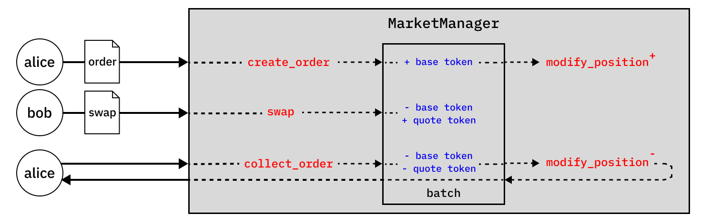

# Technical overview

This document provides an overview of Sphinx's smart contracts. It focuses on the call logic for the five main functions called by the user, including breaking down the internal call logic and mapping external interactions with strategy contracts.

## Contracts

### `MarketManager`

The `MarketManager` contract is the main entrypoint for all user interactions. It is responsible for:

1. Creating new markets
2. Adding and removing liquidity to new or existing positions
3. Swapping assets through one or multiple markets
4. Placing and collecting limit orders
5. Other miscellaneous actions such as flash loans, protocol fees, sweeping etc

### `Strategy`

`Strategy` contracts are optional contracts that can be deployed alongside a market. They are responsible for:

1. Providing liquidity to the market by placing and removing liquidity positions and limit orders
2. Collecting and distributing swap fees on behalf of LPs that deposit to the strategy

All `Strategy` contracts must implement the minimal `IStrategy` interface, as follows:

```rust
#[starknet::interface]
trait IStrategy<TContractState> {
  // View
  fn market_manager(self: @TContractState) -> ContractAddress;
  fn market_id(self: @TContractState) -> felt252;
  fn strategy_name(self: @TContractState) -> felt252;
  fn strategy_symbol(self: @TContractState) -> felt252;
  // External
  fn update_positions(ref self: TContractState, params: SwapParams);
  fn cleanup(ref self: TContractState);
}
```

## Contract interactions

### Creating a market

A market is created by calling `create_market()` in the `MarketManager` contract.

```rust
fn create_market(
  ref self: TContractState,
  base_token: ContractAddress,
  quote_token: ContractAddress,
  width: u32,
  strategy: ContractAddress,
  swap_fee_rate: u16,
  fee_controller: ContractAddress,
  protocol_share: u16,
  start_limit: u32,
  allow_positions: bool,
  allow_orders: bool,
  is_concentrated: bool,
) -> felt252;
```

This initialises the market with the provided parameters and assigns a `market_id`, which is simply the Poseidon chain hash of the immutable parameters. The immutable parameters are those in the list above, excluding `start_limit`, `protocol_share` and `is_concentrated` (these can be configurable later by the contract owner).

Duplicate markets are disallowed by checking the `market_id` against a mapping of existing markets.

### Adding or removing liquidity

Adding or removing liquidity is achieved by calling `modify_liquidity()`, and passing in the relevant `market_id`, a price range denominated in limits, and either a positive or negative `liquidity_delta`.

```rust
fn modify_position(
  ref self: TContractState,
  market_id: felt252,
  lower_limit: u32,
  upper_limit: u32,
  liquidity_delta: i256,
) -> (i256, i256, u256, u256);
```

### Collecting fees

Similarly, fees can be collected from an existing position by calling `modify_position`, and passing in a `liquidity_delta` of 0.

```rust
fn modify_position(
  ref self: TContractState,
  market_id: felt252,
  lower_limit: u32,
  upper_limit: u32,
  liquidity_delta: i256,
) -> (i256, i256, u256, u256);
```

### Swapping tokens (single market)

A swap is intitiated when a swapper calls `swap()` in the `MarketManager` contract.

```rust
fn swap(
  ref self: TContractState,
  market_id: felt252,
  is_buy: bool,
  amount: u256,
  exact_input: bool,
  threshold_sqrt_price: Option<u256>,
  deadline: Option<u64>,
) -> (u256, u256, u256);
```

If the market is deployed with a strategy, this complicates the call logic somewhat:

- The swap will first execute the `update_positions()` function of the `Strategy` contract. This can include instructions to place or remove liquidity positions or limit orders, which may involve further `modify_position` calls to the `MarketManager` contract.
- Once executed, the call returns to the `MarketManager` context and executes the swap.
- Finally, the `cleanup()` function of the `Strategy` contract is called to perform residual updates, if any.

The diagram below summarises the execution flow:

#### Fig 1. Swap execution flow


### Swapping tokens (multi market)

A multi-market swap is intitiated when a swapper calls `swap_multiple()` in the `MarketManager` contract.

```rust
fn swap_multiple(
  ref self: TContractState,
  base_token: ContractAddress,
  quote_token: ContractAddress,
  is_buy: bool,
  amount: u256,
  route: Span<felt252>,
  deadline: Option<u64>,
) -> u256;
```

This function calls `swap()` for each market in the route, passing in the output amount of the previous swap as the input amount for the next swap. The execution flow for each `swap` is identical to the single market case.

### Creating a limit order

Limit orders can be placed by calling `create_order()` in the `MarketManager` contract.

```rust
fn create_order(
    ref self: TContractState,
    market_id: felt252,
    is_bid: bool,
    limit: u32,
    liquidity_delta: u256,
) -> felt252;
```

This initialises the order with the provided parameters and assigns an `order_id` from an incrementing counter. Under the hood, creating a limit order places a liquidity position at the specified `limit` (technically, over the interval between `limit` and `limit` + `width`). All limit orders placed at the same `limit` are batched for efficient filling. Once filled, a `nonce` counter increases for that limit to start a new batch.

The filling of limit orders is handled in the `swap` function. The `swap` function iteratively searches for the next initialised limit and fills the swap order against available liquidity between the current and next limit. Where a limit order is:

- Fully filled, the liquidity for that batch is removed by calling the internal `_modify_liquidity()` function, and the base and quote balances updated
- Partially filled, the base and quote balances for the batch are updated without removing liquidity from the batch.

### Collecting a limit order

Collecting a limit order returns any filled and unfilled amounts to the order owner.

In a traditional order book setting, proceeds from filled limit orders are automatically returned to the swapper's account. Alternatively, the order can be cancelled to return any unfilled or partially filled proceeds. Since automatic token transfer is not gas efficient in a blockchain setting, both actions above are combined into a single `collect_order()` function.

```rust
fn collect_order(
  ref self: TContractState,
  market_id: felt252,
  order_id: felt252,
) -> (u256, u256);
```

Collecting an order withdraws the owner's pro rata share of the batch's base and quote balances. If the order is partially filled, a `_modify_position()` call is made to remove the withdrawing user's liquidity from the batch and pool.

The lifecycle of a limit order is summarised in the diagrams below.

#### Fig 2a. Order execution flow (fully filled)


#### Fig 2b. Order execution flow (partially filled)



### Upgrading the `MarketManager` contract

The `MarketManager` contract can be upgraded by the contract `owner` via the `upgrade()` function, which replaces the class hash of the contract.

## Custom types

We define custom `i32` and `i256` types plus accompanying math libaries as signed integers are not yet fully supported on Starknet.

### `i32`

```rust
struct i32 {
  val: u32,
  sign: bool
}
```

### `i256`

```rust
struct i256 {
  val: u256,
  sign: bool
}
```
